# TCC_SDT_Experiments

This repository contains the files used to run experiments for **Invariant recognition memory spaces for real-world objects revealed with signal-detection analysis** by Igor Utochkin (University of Chicago, IL, USA),  Daniil Azarov (Indiana University Bloomington, IN, USA), & Daniil Grigorev (Koç University, Turkiye).

# Files

The **files** included are:
1. .js and .html files automatically generated by PsychoPy to run experiments online via Pavlovia.org;
2. .jpg files (stimuli images) from:
   - [The “Massive Memory - Object Categories” stimuli set](https://bradylab.ucsd.edu/stimuli.html) (Konkle, T., Brady, T. F., Alvarez, G. A. and Oliva, A. (2010). Conceptual distinctiveness supports detailed visual long-term memory for real-world objects. Journal of Experimental Psychology: General, 139(3), 558-78);
   -  [The Exemplar-State stimuli set](https://bradylab.ucsd.edu/stimuli.html) (Brady, T. F., Konkle, T., Alvarez, G.A., and Oliva, A. (2013). Real-world objects are not represented as bound units: Independent forgetting of different object details from visual memory. Journal of Experimental Psychology: General, 142(3), 791-808);
4. .xlsx files containing information about how stimuli were assigned across groups.

# Experiment Details

All the experiments are very similar and differ only in minor details.

1. **Experiment 1**
   - Memory Phase: presentation - 1,000 ms, interstimulus interval (ISI) - 500 ms
   - Stimuli: 2 items from each of 2 categories 
2. **Experiment 2**
   - Memory Phase: presentation - 250 ms, ISI as in Exp 1
   - Stimuli: as in Exp 1
3. **Experiment 3**
   - Memory Phase: as in Exp 1
   - Stimuli: 2 exemplars in 2 states each

## Experimental Groups

Each experiment contains 4 groups: **3 groups with 2-AFC tasks** and **1 group with a 4-AFC task**.
- **4-AFC task**: a participant selects the target among 3 foils.
- **2-AFC task**: a participant selects the target among a single foil.

To counterbalance the 2-AFC task - because there are always two items from each of the two categories in Experiments 1 & 2, and 2 exemplars in 2 differet states in Experiment 3 - across participants, we used a **Latin Square design**:

|           | Group 1 (2AFC_1)| Group 2 (2AFC_2)| Group 3 (2AFC_3)| Group 4 (4AFC)|
|-----------|-----------|----------|----------|----------|
|Target 1 vs| Foil 1    | Foil 2   | Foil 3   |Foils 1, 2, 3 |
|Target 2 vs| Foil 2    | Foil 3   | Foil 1   |Foils 1, 2, 3 |
|Target 3 vs| Foil 3    | Foil 1   | Foil 2   |Foils 1, 2, 3 |
|...        | ...       | ...      | ...      |...           |

### Example of Stimulus Assignment

|           | Group 1 (2AFC_1)| Group 2 (2AFC_2)| Group 3 (2AFC_3)| Group 4 (4AFC)|
|-----------|-----------|----------|----------|----------|
|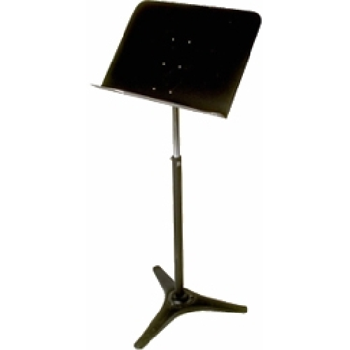|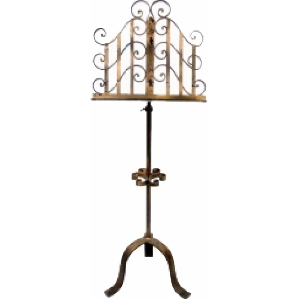||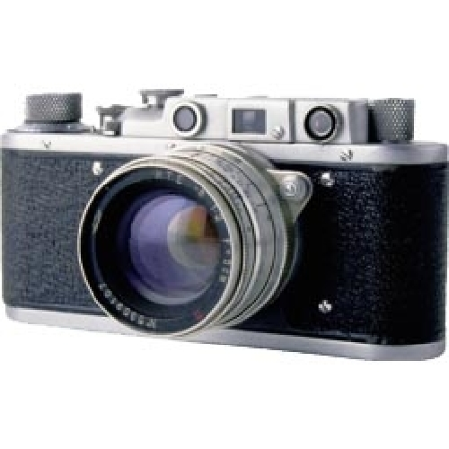||
|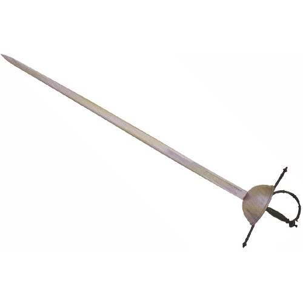|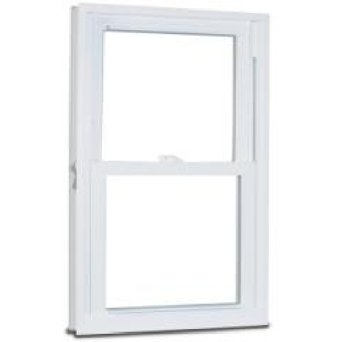|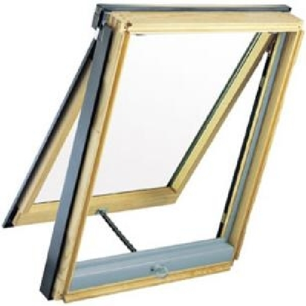|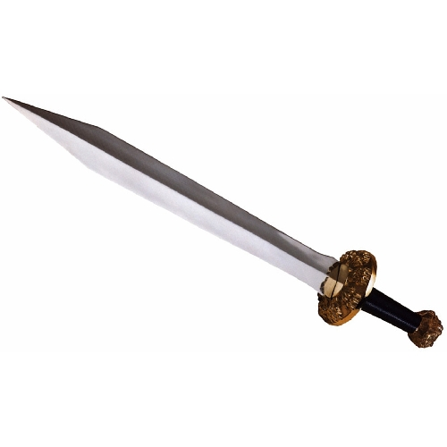||
|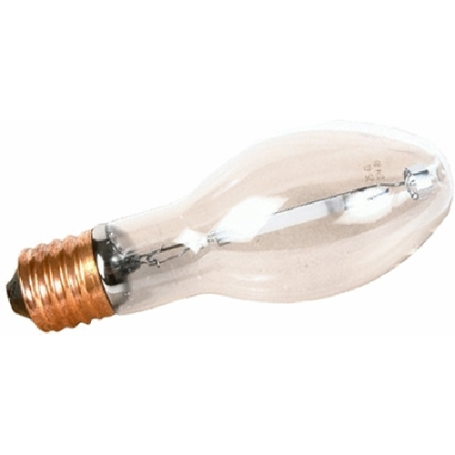|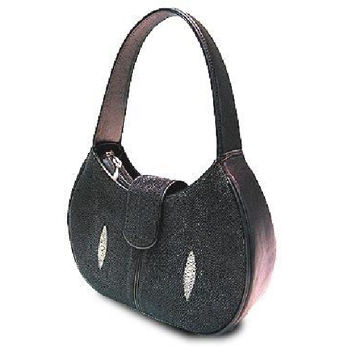|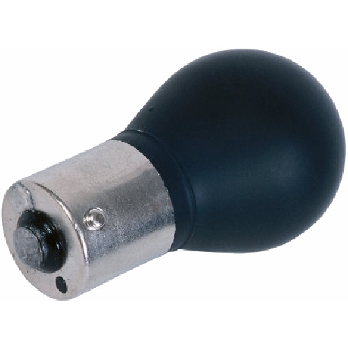|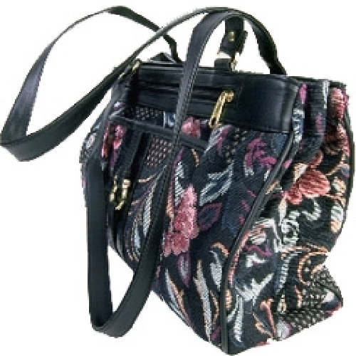||
|...        | ...       | ...      | ...      | ...      |

To run an experiment for demonstration purposes, you can download it to your local machine and then upload to your own Pavlovia account, or simply clone the repository to your GitLab.
